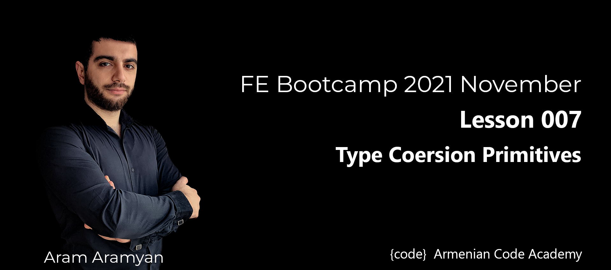

---

***What will be the result and why?***\
[1_whatTheResult.js](1_whatTheResult.js)
___

***2 Write logic that implements parseInt.***\
[2_parseIntLogic.js](2_parseIntLogic.js)
___

***3 Write logic that implements parseFloat.***\
[3_parseFloatLogic.js](3_parseFloatLogic.js)
___